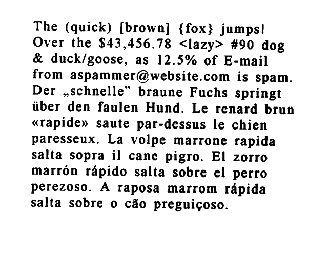

A wrapper to work with Tesseract OCR inside PHP via CLI and/or FFI interfaces.

[](https://travis-ci.org/vkhramtsov/tesseract-bridge)
[](https://www.codacy.com/gh/vkhramtsov/tesseract-bridge/dashboard?utm_source=github.com&amp;utm_medium=referral&amp;utm_content=vkhramtsov/tesseract-bridge&amp;utm_campaign=Badge_Grade)
[](https://codecov.io/gh/vkhramtsov/tesseract-bridge)
[](https://scrutinizer-ci.com/g/vkhramtsov/tesseract-bridge/?branch=master)

:bangbang: **Tested only on FreeBSD and Debian and Ubuntu platforms with [Tesseract OCR](https://github.com/tesseract-ocr/tesseract) version 3 and 4 (see build logs).**

## Installation

Via [Composer](https://getcomposer.org/):

    $ composer require bicycle/tesseract-bridge

## Usage

### Basic usage

  

- CLI
  ```php
  use Bicycle\Tesseract\Bridge as TesseractBridge;
  
  $configuration = TesseractBridge\Configuration(['binary_path' => 'tesseract']);
  $bridge = new TesseractBridge\CLI($configuration);
  echo $bridge->testGetVersion();
  print_r($bridge->getAvailableLanguages());
  echo $bridge->recognizeFromFile('eurotext.png'); // Set proper path here
  ```

- FFI
  ```php
  use Bicycle\Tesseract\Bridge as TesseractBridge;
  
  $configuration = TesseractBridge\Configuration(['binary_path' => 'tesseract']);
  $bridge = new TesseractBridge\FFI($configuration);
  echo $bridge->testGetVersion();
  print_r($bridge->getAvailableLanguages());
  echo $bridge->recognizeFromFile('eurotext.png'); // Set proper path here
  ```

### With languages

- CLI
  ```php
  use Bicycle\Tesseract\Bridge as TesseractBridge;
  
  $configuration = TesseractBridge\Configuration(['binary_path' => 'tesseract']);
  $bridge = new TesseractBridge\CLI($configuration);
  echo $bridge->testGetVersion();
  print_r($bridge->getAvailableLanguages());
  echo $bridge->recognizeFromFile('eurotext.png', ['deu']); // Set proper path here
  ```

- FFI
  ```php
  use Bicycle\Tesseract\Bridge as TesseractBridge;
  
  $configuration = TesseractBridge\Configuration(['binary_path' => 'tesseract']);
  $bridge = new TesseractBridge\FFI($configuration);
  echo $bridge->testGetVersion();
  print_r($bridge->getAvailableLanguages());
  echo $bridge->recognizeFromFile('eurotext.png', ['deu']); // Set proper path here
  ```

## How to contribute

You can contribute to this project by:

-   Opening an [Issue](../../issues) if you found a bug or wish to propose a new feature;
-   Opening [PR](../../pulls) if you want to improve/create/fix something

## Additional
Please check our [FAQ](./Resources/doc/faq.rst)

## License

tesseract-bridge is released under the [MIT License](./LICENSE).
